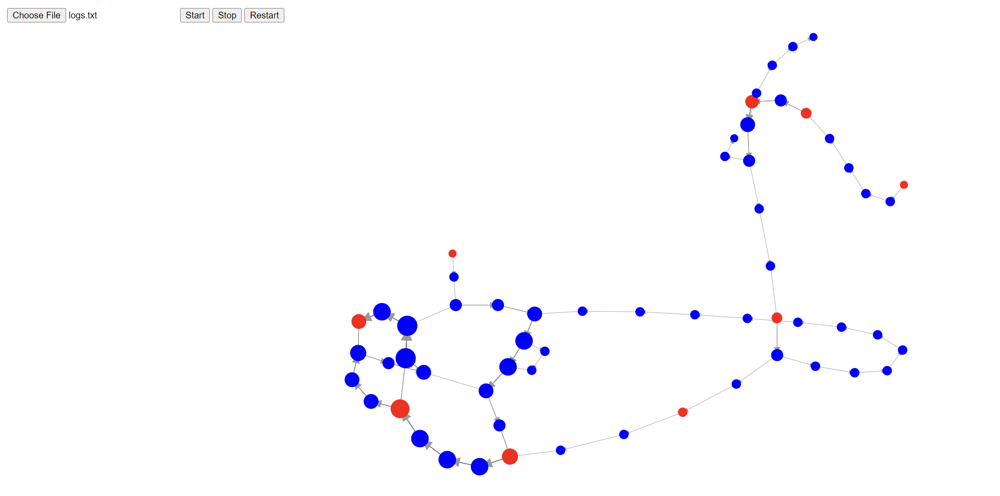
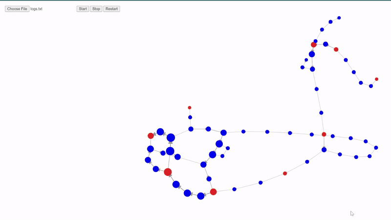

# Graph Visualiser

## Description

For the log file given as example ./log.txt, the graph visualiser will generate a graph as shown below.

when you press start button, the graph will be animated and the parallel walks will be visualised.

## How to run

Go to [deployed site](https://random-walk-visualiser-for-cs-441.vercel.app/) and upload the log file and press start button.